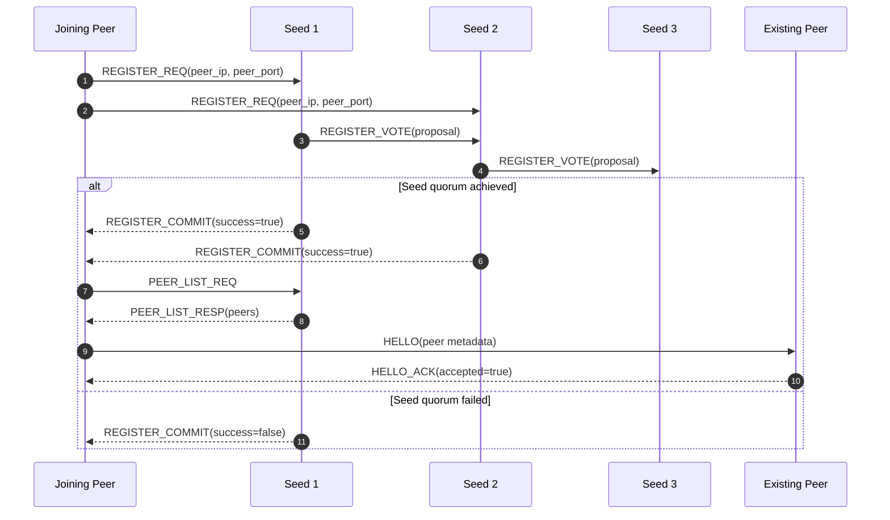

# Gossip-Based P2P Network with Two-Level Consensus

Last updated: 26 Feb 2026

This project implements a gossip-based peer-to-peer (P2P) network with:

- reliable message dissemination,
- robust liveness detection,
- consensus-driven membership management at both peer and seed layers.

The implementation follows the assignment requirement that no single node can unilaterally add or remove peers.

---

## 1) System Overview

The network has two node types:

### Seed Nodes

- Maintain a **Peer List (PL)** of known peers.
- Handle peer registration and peer removal proposals.
- Reach consensus with other seeds using quorum voting.
- Serve peer lists to joining peers.
- Do **not** participate in gossip forwarding.

### Peer Nodes

- Read seed endpoints from `config.txt`.
- Register with at least `floor(n/2)+1` seeds.
- Build overlay neighbors from seed-provided peer lists.
- Disseminate gossip messages.
- Detect suspected dead peers and run peer-level consensus before reporting.

### High-Level Architecture

```mermaid
flowchart TB
	%% Client peer attempting bootstrap
	J[Joining Peer J]

	subgraph S[Seed Layer (Membership Authority)]
		S1[Seed 1\nPL + vote state]
		S2[Seed 2\nPL + vote state]
		S3[Seed 3\nPL + vote state]
		S1 <-. REGISTER_VOTE / SEED_DEAD_VOTE .-> S2
		S2 <-. REGISTER_VOTE / SEED_DEAD_VOTE .-> S3
		S1 <-. REGISTER_VOTE / SEED_DEAD_VOTE .-> S3
	end

	subgraph P[Peer Overlay Layer (Gossip Plane)]
		P1[Peer A]
		P2[Peer B]
		P3[Peer C]
		P4[Peer D]
		P1 <--> P2
		P2 <--> P3
		P3 <--> P4
		P4 <--> P1
		P1 <--> P3
	end

	%% Bootstrap + registration quorum
	J -->|REGISTER_REQ| S1
	J -->|REGISTER_REQ| S2
	J -->|REGISTER_REQ| S3
	S1 -->|REGISTER_COMMIT / ABORT| J
	S2 -->|REGISTER_COMMIT / ABORT| J
	J -->|PEER_LIST_REQ| S1
	S1 -->|PEER_LIST_RESP| J
	J -->|HELLO| P1
	P1 -->|HELLO_ACK| J

	%% Normal gossip dissemination
	P1 -->|GOSSIP_MSG| P2
	P2 -->|GOSSIP_MSG| P3
	P3 -->|GOSSIP_MSG| P4
	P4 -->|GOSSIP_MSG| P1

	%% Two-level dead-node handling
	P2 -->|SUSPECT_REQ| P3
	P3 -->|SUSPECT_ACK| P2
	P2 -->|DEAD_REPORT(Node X)| S1
	S1 -->|SEED_DEAD_VOTE(Node X)| S2
	S2 -->|SEED_DEAD_VOTE(Node X)| S3
	S1 -->|SEED_DEAD_COMMIT / ABORT| S2
	S2 -->|SEED_DEAD_COMMIT / ABORT| S3
```

Architecture details highlighted:

- **Control plane vs data plane split**: seeds manage membership; peers carry gossip.
- **Bootstrap pipeline**: register → quorum decision → peer list fetch → overlay handshake.
- **Inter-seed quorum workflow** for both registration and dead-node removal.
- **Two-level failure handling**: peer confirmation precedes seed membership update.

### Dead-Node Removal Sequence (Detailed)

```mermaid
sequenceDiagram
	autonumber
	participant P2 as Peer B (Detector)
	participant P3 as Peer C (Neighbor Witness)
	participant P4 as Peer D (Neighbor Witness)
	participant S1 as Seed 1
	participant S2 as Seed 2
	participant S3 as Seed 3

	Note over P2,P4: Level 1: Peer-side suspicion consensus
	P2->>P3: SUSPECT_REQ(Node X)
	P2->>P4: SUSPECT_REQ(Node X)
	P3-->>P2: SUSPECT_ACK(agree=true)
	P4-->>P2: SUSPECT_ACK(agree=true)

	alt Peer-level majority reached
		P2->>S1: DEAD_REPORT(Node X, reporter=P2)
		P2->>S2: DEAD_REPORT(Node X, reporter=P2)
		Note over S1,S3: Level 2: Seed-side quorum consensus
		S1->>S2: SEED_DEAD_VOTE(Node X)
		S2->>S3: SEED_DEAD_VOTE(Node X)
		S3-->>S1: Vote ACK
		alt Quorum achieved
			S1->>S2: SEED_DEAD_COMMIT(Node X)
			S2->>S3: SEED_DEAD_COMMIT(Node X)
			Note over S1,S3: Remove Node X from Peer List (PL)
		else Quorum not achieved
			S1->>S2: SEED_DEAD_ABORT(Node X)
			S2->>S3: SEED_DEAD_ABORT(Node X)
			Note over S1,S3: Keep Node X in PL
		end
	else Peer-level majority not reached
		Note over P2,S3: No DEAD_REPORT sent; no seed-side action
	end
```

Sequence details highlighted:

- **Gate 1 (peer majority)** avoids unilateral or noisy dead reports.
- **Gate 2 (seed quorum)** prevents single-seed membership mutation.
- **Commit/abort branching** is explicit for deterministic cluster state transitions.
- **Duplicate late reports** after commit may validly abort with no additional state change.

### Peer Join and Bootstrap Sequence (Detailed)



Join flow details highlighted:

- **Quorum-first admission** ensures a peer is accepted only after majority seed agreement.
- **Post-commit discovery** fetches current peer list for overlay construction.
- **HELLO/HELLO_ACK handshake** finalizes neighbor connectivity before gossip starts.

---

## 2) Consensus Model

### Quorum Rule

For `n` seeds, required quorum is:

`floor(n/2)+1`

This is used for:

1. **Peer registration** (admit new node),
2. **Peer removal** (remove dead node from PL).

### Two-Level Dead-Node Validation

1. **Peer-level consensus:** neighbors must independently confirm a suspect node is unresponsive.
2. **Seed-level consensus:** seeds vote on removal before updating PL.

This design mitigates false accusations and unilateral removal.

---

## 3) Implemented Features

### A. Seed-Side Membership Consensus (`seed.py`)

- Registration proposal + inter-seed vote exchange.
- Commit/abort synchronization among seeds.
- Dead-node report handling + inter-seed removal voting.
- Commit/abort synchronization for removals.
- Threaded TCP server for concurrent requests.

### B. Peer Bootstrap & Overlay (`peer.py`)

- Quorum registration with randomly chosen seeds.
- Peer-list union retrieval from connected seeds.
- Explicit topology representation via adjacency structures.
- Power-law style neighbor selection heuristic.
- `HELLO` / `HELLO_ACK` neighbor handshake.

### C. Gossip Dissemination (`peer.py`)

- Gossip generation interval: every 5 seconds.
- Max generated messages per peer: 10.
- Gossip format:

  `<self.timestamp>:<self.IP>:<self.Msg#>`

- Hash-based message de-duplication.
- First-time receive forwarding to all neighbors except sender.

### D. Liveness Detection + Dead-Node Reporting (`peer.py`)

- Periodic neighbor checks.
- Suspicion threshold before triggering consensus.
- Peer-level suspicion voting via `SUSPECT_REQ/SUSPECT_ACK`.
- Dead report sent to seeds only after peer-level majority agreement.
- Dead report format:

  `Dead Node:<DeadNode.IP>:<DeadNode.Port>:<self.timestamp>:<self.IP>`

---

## 4) Message Types

Implemented protocol message types:

- `REGISTER_REQ`
- `REGISTER_VOTE`
- `REGISTER_COMMIT`
- `PEER_LIST_REQ`
- `PEER_LIST_RESP`
- `HELLO`
- `HELLO_ACK`
- `GOSSIP_MSG`
- `SUSPECT_REQ`
- `SUSPECT_ACK`
- `DEAD_REPORT`
- `SEED_DEAD_VOTE`
- `SEED_DEAD_COMMIT`
- `ERROR`

Messages are newline-delimited JSON over TCP sockets.

---

## 5) Repository Structure

- `seed.py` — seed node server and seed consensus flows.
- `peer.py` — peer bootstrap, gossip, liveness and peer consensus.
- `config.txt` — list of seed `IP,PORT` entries.
- `outputfile.txt` — consolidated runtime log output.
- `TASK3_TESTING.md` — bootstrap/overlay testing.
- `TASK4_TESTING.md` — gossip/de-dup testing.
- `TASK5_TESTING.md` — liveness + two-level consensus testing.
- `EXECUTION_PLAN.md` — one-day task-wise execution plan.

---

## 6) Environment Requirements

- macOS/Linux (tested on macOS)
- Python 3.10+ (works with current local Python)
- Terminal with `ping` command available

No external Python packages are required.

---

## 7) Configuration

Edit `config.txt` to define seed nodes, one per line in this format:

`<ip>,<port>`

Example:

```text
127.0.0.1,5001
127.0.0.1,5002
127.0.0.1,5003
```

Quorum is computed automatically from number of configured seeds.

---

## 8) How to Run

### Step 0: Clean old logs/processes

```bash
pkill -f "seed.py" 2>/dev/null || true
pkill -f "peer.py" 2>/dev/null || true
: > outputfile.txt
```

### Step 1: Start seed nodes (separate terminals)

```bash
python3 seed.py --ip 127.0.0.1 --port 5001 --config config.txt --output outputfile.txt
python3 seed.py --ip 127.0.0.1 --port 5002 --config config.txt --output outputfile.txt
python3 seed.py --ip 127.0.0.1 --port 5003 --config config.txt --output outputfile.txt
```

### Step 2: Start peer nodes (separate terminals)

```bash
python3 peer.py --ip 127.0.0.1 --port 6001 --config config.txt --output outputfile.txt
python3 peer.py --ip 127.0.0.1 --port 6002 --config config.txt --output outputfile.txt
python3 peer.py --ip 127.0.0.1 --port 6003 --config config.txt --output outputfile.txt
python3 peer.py --ip 127.0.0.1 --port 6004 --config config.txt --output outputfile.txt
```

### Step 3: Monitor logs

```bash
tail -f outputfile.txt
```

Useful filtered views:

```bash
tail -f outputfile.txt | grep -E "Registration quorum|Bootstrap complete"
tail -f outputfile.txt | grep -E "Generated gossip|First-time gossip received|Duplicate gossip ignored"
tail -f outputfile.txt | grep -E "suspicion|Dead-node consensus|DEAD_REPORT|COMMIT|ABORT"
```

---

## 9) Validation Checklist

### Registration and Bootstrap

- Peer logs show: `Registration quorum achieved ...`
- Peer logs show: `Bootstrap complete ...`

### Gossip

- Sender logs show: `Generated gossip ...`
- Receivers show: `First-time gossip received ...`
- Repeat deliveries show: `Duplicate gossip ignored ...`

### Liveness and Removal

1. Kill one peer process.
2. Observe:
	- `Neighbor suspicion triggered ...`
	- `Peer-level suspicion result ... consensus=True`
	- `Dead-node consensus COMMIT ...` on seeds
3. Additional duplicate reports may produce `ABORT` (expected after first commit).

---

## 10) Logging and Observability

Both seed and peer nodes log to:

1. stdout (terminal), and
2. shared output file (`outputfile.txt`).

Logged events include:

- proposals and votes,
- commit/abort decisions,
- peer list responses,
- first-time gossip receive events,
- dead-node reporting outcomes.

Ping packets themselves are not logged by design.

---

## 11) Security Considerations

The design includes two important protections:

1. **Peer-level confirmation before reporting failure**
	- reduces risk of a single malicious peer falsely reporting others as dead.

2. **Seed-level quorum before membership update**
	- prevents unilateral add/remove decisions.

Discussable risks and mitigations during evaluation:

- colluding peers creating false suspicions,
- colluding seeds approving invalid membership changes,
- replay/forged messages without authentication,
- DOS risk from repeated connect/report floods.

Current implementation focuses on assignment-scope consensus mechanics; cryptographic authentication is outside current scope.

---

## 12) Notes and Practical Limits

- Demonstrations commonly use 3 seeds and 3–4 peers for clarity.
- The implementation scales to larger `n` and peer counts via `config.txt` and unique ports.
- Power-law formation uses a practical heuristic with explicit topology tracking.


## 13) Author Notes

This repository is structured to support both:

- quick local demonstration on one machine (multi-terminal), and
- extension to multi-machine deployment with real IP endpoints.
